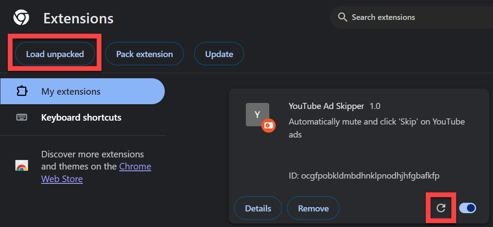

# About

I made this ad skipper because of YouTube's new policy of disabling video playback when you have an ad blocker enabled. This doesn't block in-video ads from loading, it just skips them.

# Features

- Automatically click the Skip Ad button as soon as possible
- Mute videos during ads then unmute after
- Hide inline ads on homepage

# Run Locally

```
# INITIAL SETUP
git clone https://github.com/adamerose/youtube-ad-skipper
Open chrome://extensions/ -> Click Load Unpacked -> Select this project as folder

# UPDATING
git pull
Open chrome://extensions/ -> Click the refresh button on YouTube Ad Skipper card
```



# Todo

- On the homepage there's a blank spot left behind when I delete inline ads.
  - Seems to be because grid layout is JS not CSS
  - Is it possible to fix thumnail layout after deleting inline ad?
  - Maybe delete the ad from the underlying JS object instead of the generated HTML?
