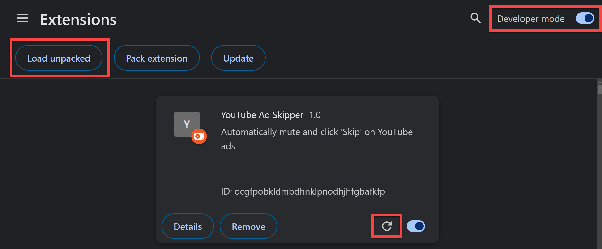

# About

I made ad skipper this because of YouTube's new policy of disabling video playback when you have an ad blocker enabled. This doesn't block ads it just skips them.

## Features

- Automatically click the Skip Ad button as soon as possible
- Mute videos during ads then unmute after

# Run Locally

```
# INITIAL SETUP
git clone https://github.com/adamerose/youtube-ad-skipper
cd youtube-ad-skipper
Open chrome://extensions/ -> Click Load Unpacked -> Select this project as folder

# UPDATING
git pull
Open chrome://extensions/ -> Click the refresh button on YouTube Ad Skipper card
```


